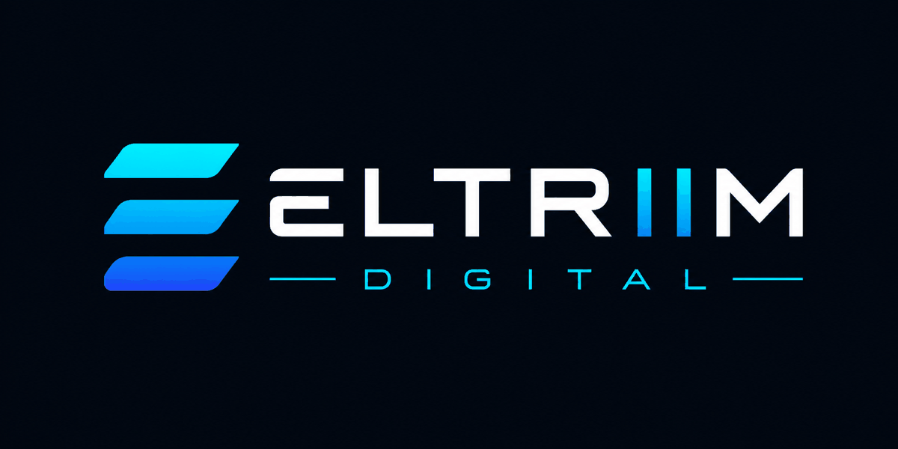

# ELTRIIM Central Demo

<p align="center">
  
</p>

<p align="center">
  <strong>Demonstração pública de uma central de prospecção comercial criada para a ELTRIIM Digital.</strong>
</p>

<p align="center">
  <a href="https://eltriim-central-demo.thais-btle.chatgpt.site/">Acessar demonstração</a>
  ·
  <a href="#recursos-demonstrados">Recursos</a>
  ·
  <a href="#executar-localmente">Executar localmente</a>
</p>

> **Ambiente demonstrativo:** todas as empresas, pessoas, telefones, avaliações e atividades exibidas são fictícias. As fotografias são apenas ilustrativas.

## Sobre o projeto

A **ELTRIIM Central Demo** apresenta uma versão pública e segura da central interna de prospecção da ELTRIIM Digital. O projeto demonstra como pesquisas de mercado podem ser organizadas em oportunidades comerciais, acompanhadas desde a análise inicial até o contato e a proposta.

O painel foi desenvolvido com a identidade visual oficial da ELTRIIM, suporte aos temas claro e escuro e uma experiência adaptável a diferentes tamanhos de tela.

## Demonstração online

### [Abrir a ELTRIIM Central Demo](https://eltriim-central-demo.thais-btle.chatgpt.site/)

Na demonstração é possível pesquisar empresas fictícias, visualizar indicadores comerciais, alternar o tema e abrir a análise detalhada de cada oportunidade.

## Recursos demonstrados

- Painel geral com indicadores de oportunidades, ligações, contatos e propostas.
- Banco de oportunidades com busca por empresa, cidade ou nicho.
- Análise individual com potencial, responsável, telefone e status.
- Fotografias ilustrativas para pousada, salão de beleza, restaurante e clínica.
- Alternância entre os temas claro e escuro.
- Identidade visual baseada na paleta azul e ciano da ELTRIIM Digital.
- Avisos claros para distinguir a demonstração do sistema interno real.
- Layout responsivo para computadores, tablets e celulares.

## Galeria demonstrativa

<table>
  <tr>
    <td align="center"><br><strong>Hospedagem</strong></td>
    <td align="center"><br><strong>Beleza</strong></td>
  </tr>
  <tr>
    <td align="center"><br><strong>Gastronomia</strong></td>
    <td align="center"><br><strong>Saúde</strong></td>
  </tr>
</table>

## Fluxo apresentado

1. Visualizar os indicadores gerais da operação.
2. Pesquisar oportunidades por empresa, cidade ou nicho.
3. Selecionar uma empresa para abrir sua análise.
4. Conferir potencial, responsável, contato e status comercial.
5. Simular a geração de uma leadpage demonstrativa.

## Tecnologias

- Next.js
- React
- TypeScript
- CSS responsivo
- pnpm

## Executar localmente

Pré-requisitos: Node.js 20 ou superior e pnpm.

```bash
git clone https://github.com/ThaisbMoreira/eltriim-central-demo.git
cd eltriim-central-demo
pnpm install
pnpm dev
```

Abra `http://localhost:3000` no navegador.

## Privacidade e segurança

Esta versão pública não utiliza o banco de dados, a autenticação nem os registros reais da central interna. Nenhum dado de cliente ou integrante da equipe foi incluído neste repositório.

## Autoria

Projeto idealizado e criado por **Thaís Moreira** para a **ELTRIIM Digital**.

**Slogan oficial:** *Seu negócio mais perto de quem procura.*


